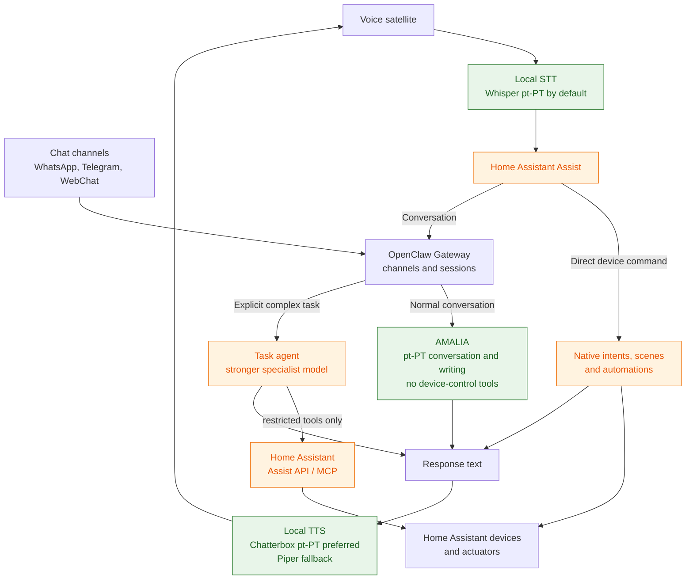

# Architecture

## Goals

- Local-first voice control with an Internet-independent path for basic device actions.
- European-Portuguese conversation and writing where it adds value.
- Multiple input channels without exposing device APIs directly to messaging apps or LLMs.
- Clear separation between device control, conversation, and complex task execution.
- Least-privilege access to automation tools.

## Reference design

## Ownership boundaries

| Component | Owns | Does not own |
|---|---|---|
| Home Assistant | Device state, automations, voice pipeline, permissions | General personal-agent memory |
| OpenClaw | Chat channels, sessions, agent routing | Direct device protocols |
| AMALIA | pt-PT conversation and writing | Device control or complex task planning |
| Task agent | Explicit research, planning, and other complex work | Unrestricted smart-home access |
